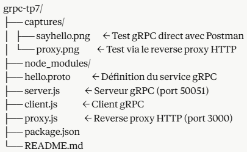
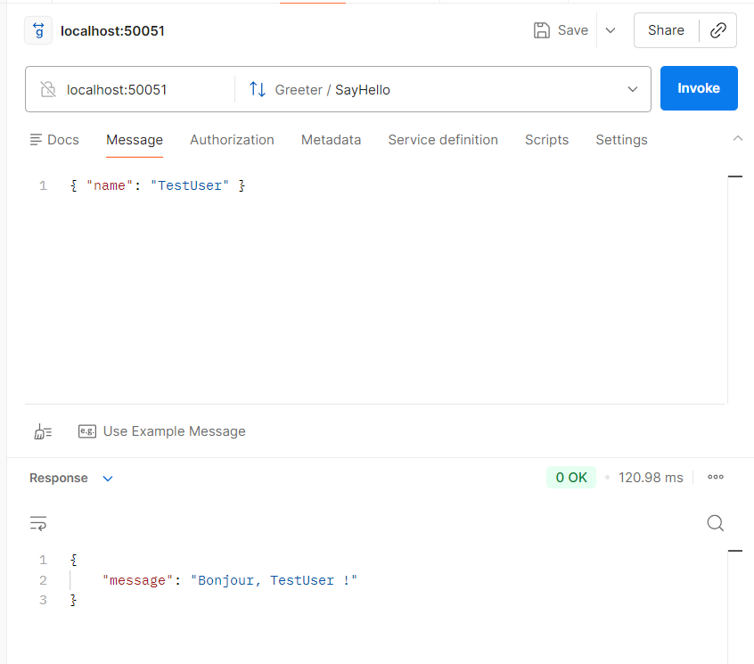
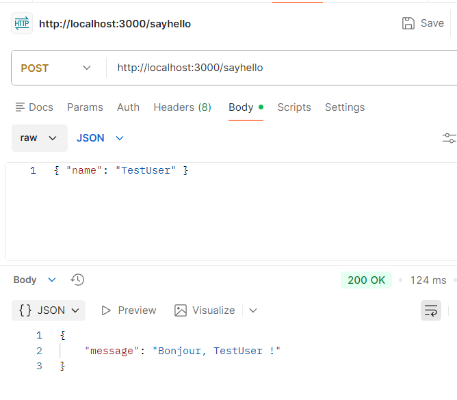

# TP7 - Introduction à gRPC

**Matière :** SoA et Microservices  
**Enseignant :** Dr. Salah Gontara  
**Classe :** 4Info  

---

## Objectifs

- Mettre en place un service **gRPC** qui reçoit des requêtes et renvoie des réponses structurées
- Créer un **reverse proxy HTTP** qui redirige les requêtes vers le service gRPC

---

## Outils utilisés

- **Node.js**
- **Protocol Buffers (protobuf)** — sérialisation des données
- **gRPC** — communication entre services
- **Express.js** — reverse proxy HTTP
- **Postman** — tests des requêtes

---

## Structure du projet

---

## Installation

```bash
npm install
```

---

## Lancer le projet

### 1. Démarrer le serveur gRPC

```bash
node server.js
```
Résultat : `Serveur gRPC démarré sur 0.0.0.0:50051`

### 2. Démarrer le client gRPC

Dans un deuxième terminal :
```bash
node client.js
```
Résultat : `Réponse du serveur : Bonjour, TestUser !`

### 3. Démarrer le reverse proxy

Dans un troisième terminal :
```bash
node proxy.js
```
Résultat : `Reverse Proxy HTTP démarré sur http://localhost:3000`

---

## Tests avec Postman

### Test 1 — Appel gRPC direct

| Champ | Valeur |
|-------|--------|
| Protocole | gRPC |
| Hôte | `localhost:50051` |
| Service | `Greeter` |
| Méthode | `SayHello` |
| Message envoyé | `{ "name": "TestUser" }` |
| Réponse reçue | `{ "message": "Bonjour, TestUser !" }` |



---

### Test 2 — Appel via le Reverse Proxy HTTP

| Champ | Valeur |
|-------|--------|
| Protocole | HTTP |
| Méthode | POST |
| URL | `http://localhost:3000/sayhello` |
| Body (JSON) | `{ "name": "TestUser" }` |
| Réponse reçue | `{ "message": "Bonjour, TestUser !" }` |



---

## Explication du fonctionnement
Client HTTP (Postman)
↓
Reverse Proxy Express (port 3000)
↓
Serveur gRPC (port 50051)
↓
Réponse : "Bonjour, TestUser !"
1. Le **client** envoie une requête HTTP au reverse proxy
2. Le **reverse proxy** la convertit en appel gRPC
3. Le **serveur gRPC** traite la requête et renvoie la réponse
4. Le **reverse proxy** renvoie la réponse en JSON au client